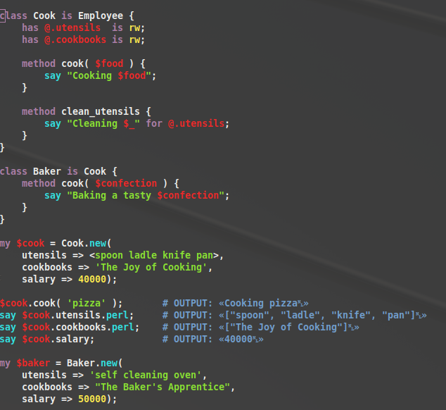
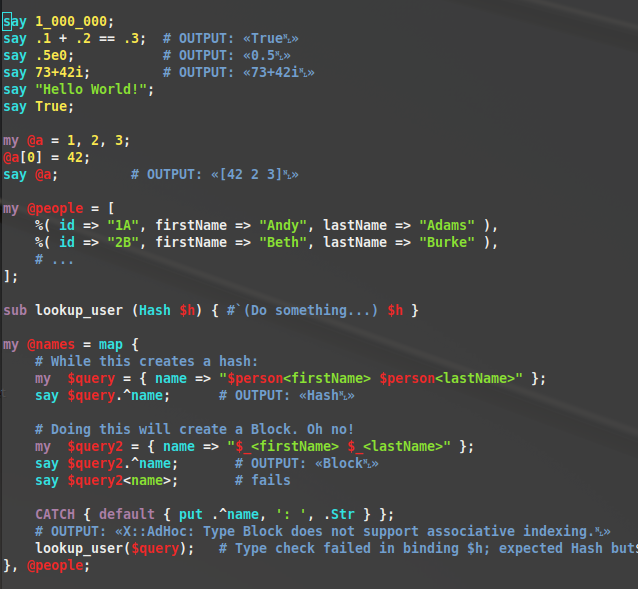

# perl6.nanorc
Nano syntax highlighting for Perl 6

## How To:
1. Place ```perl6.nanorc``` somehwere (usually under ```~/.nano```)
2. Add the following line ```include "~/.nano/perl6.nanorc"``` to your ```~/.nanorc``` file

## Screenshots




## License
GPL 3 or later
