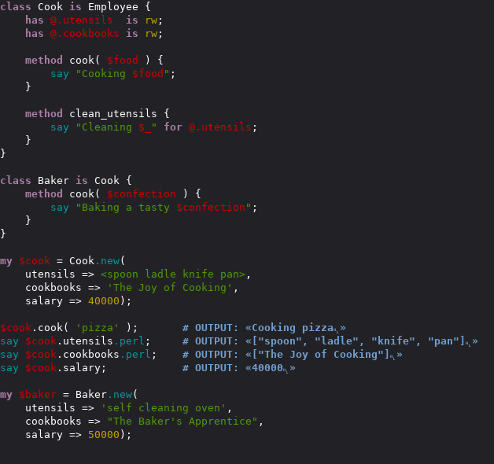
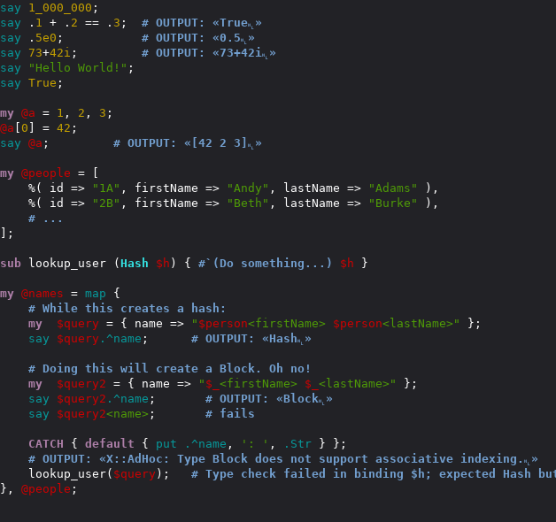
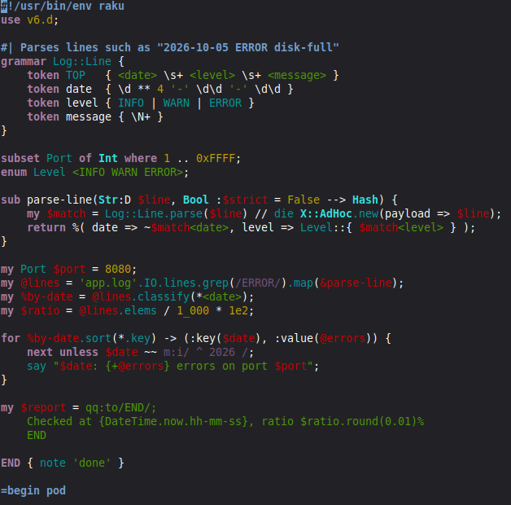

# raku.nanorc
Raku Syntax Highlighting for Nano

## How To
1. Place ```raku.nanorc``` somewhere (usually under ```~/.nano```)
2. Add the following line ```include "~/.nano/raku.nanorc"``` to your ```~/.nanorc``` file

Files with the legacy extensions (.p6, .pl6, .pm6, .pod6, .t6) are highlighted too.

The colours come from your terminal's palette, so they follow its theme, light or dark.

## Screenshots






## Known limits
Nano highlights with regular expressions only, so a few things cannot be done properly:

- A `#` after a space inside a string starts a comment.
- An apostrophe inside an identifier (`doesn't-work`) starts a string.
- Nested brackets in embedded comments end at the first closing bracket.
- A `/regex/` without a prefix is only recognised after `~~`, an opening bracket, a comma, `= `, `: `, some keywords, or at the start of a line. Brackets and commas inside such a regex are left unpainted.
- Heredocs are recognised when the terminator is in capitals (`END`, `EOF`).
- Heredocs, Pod and embedded comments also start inside strings and comments, as multi-line rules cannot see what was painted before them.
- `< a b c >` with spaces inside the brackets is not painted, as it cannot be told apart from two comparisons. Neither are `q[...]` and `q{...}`, which look like subscripts of a variable named `q`.

## License
GPL 3 or later
